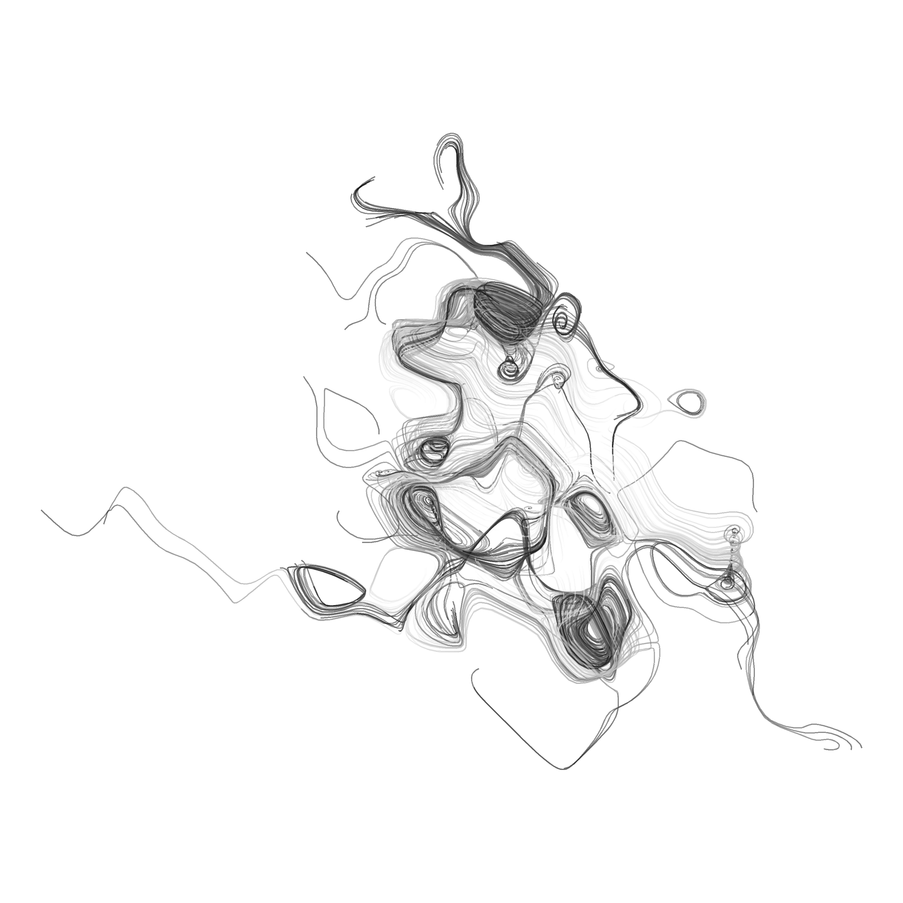

The project initiated as a hobby is to explore the artistic side of R with the help of programming. 

Current attempts are  
1. aRt Programming - Danielle Navarro ([YouTube Tutorials](https://www.youtube.com/channel/UCfNGzUFfsy_3udMY8UyaqBA))  
	1.1 Scrawl in R 
